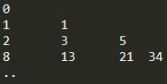

<h1 align="center">DSA Level 1 🔥</h1>
<h2 align="center">Basics of Programming</h2>
<h3 align="center">Getting Started</h3>

**Print Z**  
You are required to print a 'z' of size 5 using '*'.
```java
public class PrintZ {
    public static void main(String[] args) {
        System.out.println("*****");
        System.out.println("   * ");
        System.out.println("  *  ");
        System.out.println(" *   ");
        System.out.println("*****");
    }
}
```

**Grading System**  
1. You are given as input marks of a student.
2. Display an appropriate message based on the following rules:
  	  2.1 for marks above 90, print excellent.
  	  2.2 for marks above 80 and less than equal to 90, print good.
  	  2.3 for marks above 70 and less than equal to 80, print fair.
  	  2.4 for marks above 60 and less than equal to 70, print meets expectations.
  	  2.5 for marks less than equal to 60, print below par.
    
```java
import java.util.*;

public class GradingSystem {
    public static void main(String[] args) {
        Scanner scn = new Scanner(System.in);
        int marks = scn.nextInt();

        if (marks > 90) {
            System.out.println("excellent");
        } else if (marks > 80 && marks <= 90) {
            System.out.println("good");
        } else if (marks > 70 && marks <= 80) {
            System.out.println("fair");
        } else if (marks > 60 && marks <= 70) {
            System.out.println("meets expectations");
        } else {
            System.out.println("below par");
        }
        scn.close();
    }
}
```
**Is A Number Prime**  
1. You've to check whether a given number is prime or not.
2. Take a number "t" as input representing count of input numbers to be tested.
3. Take a number "n" as input "t" number of times.
4. For each input value of n, print "prime" if the number is prime and "not prime" otherwise.
```java
import java.util.*;

public class IsPrime {
    public static void main(String[] args) {
        Scanner scn = new Scanner(System.in);
        int t = scn.nextInt();
        for (int i = 0; i < t; i++) {
            int n = scn.nextInt();
            boolean flag = true;
            for (int j = 2; j * j <= n; j++) {
                if (n % j == 0) {
                    flag = false;
                    break;
                }
            }
            if (flag) {
                System.out.println("prime");
            } else {
                System.out.println("not prime");
            }
        }
        scn.close();
    }
}
```

**Print All Primes Till N**  
1. You've to print all prime numbers between a range. 
2. Take as input "low", the lower limit of range.
3. Take as input "high", the higher limit of range.
4. For the range print all the primes numbers between low and high (both included).
```java
import java.util.*;

public class PrimesTillN {
    public static void main(String[] args) {
        // write your code here
        Scanner sc = new Scanner(System.in);
        int low = sc.nextInt();
        int high = sc.nextInt();
        for (int i = low; i <= high; i++) {
            boolean isPrime = true;
            for (int j = 2; j * j <= i; j++) {
                if (i % j == 0) {
                    isPrime = false;
                    break;
                }
            }
            if (isPrime) {
                System.out.println(i);
            }
        }
        sc.close();
    }
}
```
**Print Fibonacci Numbers Till N**  
1. You've to print first n fibonacci numbers.
2. Take as input "n", the count of fibonacci numbers to print.
3. Print first n fibonacci numbers.
```java
import java.util.*;

public class Fibonacci {
    public static void main(String[] args) {
        int a = 0;
        int b = 1;
        int c = 0;
        Scanner sc = new Scanner(System.in);
        int n = sc.nextInt();
        for (int i = 0; i < n; i++) {
            System.out.println(a);
            c = a + b;
            a = b;
            b = c;
        }
        sc.close();
    }
}
```
**Count Digits In A Number**  
1. You've to count the number of digits in a number.
2. Take as input "n", the number for which the digits has to be counted.
3. Print the digits in that number.

```java
//💡 A Number can tolerate number of division by 10 is equal to the number of digits in the number.
import java.util.*;

public class CountDigit {
    public static void main(String[] args) {
        Scanner sc = new Scanner(System.in);
        int num = sc.nextInt();
        int count = 0;
        while (num > 0) {
            count++;
            num = num / 10;
        }
        System.out.print(count);
        sc.close();
    }
}
```
**Digits Of A Number**  
1. You've to display the digits of a number.
2. Take as input "n", the number for which digits have to be displayed.
3. Print the digits of the number line-wise.
```java
import java.util.*;

public class DigitOfNumber {
    public static void main(String[] args) {
        Scanner sc = new Scanner(System.in);
        int num = sc.nextInt();
        int count = 0;
        int temp = num;
        // Counting number of digits in the number
        while (temp != 0) {
            temp = temp / 10;
            count++;
        }
        // 💡 Calculating divisor, if DigitCount is 5 then we will divide num by 10^4 to
        // get the first digit
        int div = (int) Math.pow(10, count - 1);
        while (div != 0) {
            System.out.println(num / div);
            num = num % div;
            div = div / 10;
        }
        sc.close();
    }
}
```
**Reverse A Number**  
1. You've to display the digits of a number in reverse.
2. Take as input "n", the number for which digits have to be display in reverse.
3. Print the digits of the number line-wise, but in reverse order.
```java
import java.util.*;

public class ReverseNumber {
    public static void main(String[] args) {
        Scanner sc = new Scanner(System.in);
        int num = sc.nextInt();
        while (num > 0) {
            int rem = num % 10;
            System.out.println(rem);
            num = num / 10;
        }
        sc.close();
    }
}
```
**Rotate A Number**  
1. You are given two numbers n and k. You are required to rotate n, k times to the right. If k is positive, rotate to the right i.e. remove rightmost digit and make it leftmost. Do the reverse for negative value of k. Also k can have an absolute value larger than number of digits in n.
2. Take as input n and k.
3. Print the rotated number.
4. Note - Assume that the number of rotations will not cause leading 0's in the result. e.g. such an input will not be given
   n = 12340056,
   k = 3,
   r = 05612340
```java
import java.util.*;

public class RotateNumber {
    public static void main(String[] args) {
        // write your code here
        Scanner sc = new Scanner(System.in);
        int num = sc.nextInt();
        int k = sc.nextInt();
        int temp = num;
        int count = 0;
        while (temp != 0) {
            temp = temp / 10;
            count++;
        }
        // 💡 Rotation is going to repeat itself after DigitCount
        k = k % count;

        // 💡 If K is negative, then we need to rotate to the left instead we are
        // rotating
        // to the right more number of times
        if (k < 0)
            k = k + count;
        while (k != 0) {
            int rem = num % 10;
            int quot = num / 10;
            num = rem * (int) Math.pow(10, count - 1) + quot;
            k--;
        }
        System.out.print(num);
        sc.close();
    }
}
```
**Inverse Of A Number**  
1. You are given a number following certain constraints.
2. The key constraint is if the number is 5 digits long, it'll contain all the digits from 1 to 5 without missing any and without repeating any. e.g. 23415 is a 5 digit long number containing all digits from 1 to 5 without missing and repeating any digit from 1 to 5.Take a look at few other valid numbers - 624135, 81456273 etc.Here are a few invalid numbers - 139, 7421357 etc.
3. The inverse of a number is defined as the number created by interchanging the face value and index of digits of number.e.g. for 426135 (reading from right to left, 5 is in place 1, 3 is in place 2, 1 is in place 3, 6 is in place 4, 2 is in place 5 and 4 is in place 6), the inverse will be 416253 (reading from right to left, 3 is in place 1, 5 is in place 2,2 is in place 3, 6 is in place 4, 1 is in place 5 and 4 is in place 6) More examples - inverse of 2134 is 1243 and inverse of 24153 is 24153    
4. Take as input number "n", assume that the number will follow constraints.
5. Print it's inverse.
```java
import java.util.*;

public class InverseOfaNumber {
    public static void main(String[] args) {
        Scanner sc = new Scanner(System.in);
        int num = sc.nextInt();
        int position = 1;
        int inverseNum = 0;
        while (num != 0) {
            int lastDigit = num % 10;
            num = num / 10;
            inverseNum = inverseNum + (position * (int) Math.pow(10, lastDigit - 1));
            position++;
        }
        System.out.print(inverseNum);
        sc.close();
    }
}
```
**Gcd And Lcm**  
1. You are required to print the Greatest Common Divisor (GCD) of two numbers.
2. You are also required to print the Lowest Common Multiple (LCM) of the same numbers.
3. Take input "num1" and "num2" as the two numbers.
4. Print their GCD and LCM.
```java
import java.util.*;

public class GcdAndLcm {
    public static void main(String[] args) {
        // write your code here
        Scanner sc = new Scanner(System.in);
        int num1 = sc.nextInt();
        int num2 = sc.nextInt();
        int temp1 = num1;
        int temp2 = num2;
        // 💡 GCD: Divide until remainder is 0, and in each iteration remainder will
        // become divisor & divisor will become dividend.
        // 💡 At last remainder i.e. num2 which successfully divides the num1 will be
        // the GCD.
        while (num1 % num2 != 0) {
            int rem = num1 % num2;
            num1 = num2;
            num2 = rem;
        }
        System.out.println(num2);
        System.out.println((temp1 * temp2) / num2);
        sc.close();
    }
}
```
**Prime Factorization Of A Number**  
1. You are required to display the prime factorization of a number.
2. Take as input a number n.
3. Print all its prime factors from smallest to largest.
```java
import java.util.*;

public class PrimeFactorization {

    public static void main(String[] args) {
        // write your code here
        Scanner sc = new Scanner(System.in);
        int num = sc.nextInt();
        for (int i = 2; i * i < num; i++) {
            while (num % i == 0) {
                System.out.print(i + " ");
                num = num / i;
            }
        }
        if (num > 1)
            System.out.print(num);
        sc.close();
    }
}
```
**The Curious Case Of Benjamin Bulbs**  
1. You are given n number of bulbs. They are all switched off. A weird fluctuation in voltage hits the circuit n times. In the 1st fluctuation all bulbs are toggled, in the 2nd fluctuation every 2nd bulb is toggled, in the 3rd fluctuation every 3rd bulb is toggled and so on. You've to find which bulbs will be switched on after n fluctuations.
2. Take as input a number n, representing the number of bulbs.
3. Print all the bulbs that will be on after the nth fluctuation in voltage.
```java
import java.util.*;

public class BenjaminBulbs {
    public static void main(String[] args) {
        Scanner sc = new Scanner(System.in);
        int num = sc.nextInt();
        for (int i = 1; i * i <= num; i++) {
            System.out.println(i * i);
        }
        sc.close();
    }
}
```
**Pythagorean Triplet**  
1. You are required to check if a given set of numbers is a valid pythagorean triplet.
2. Take as input three numbers a, b and c.
3. Print true if they can form a pythagorean triplet and false otherwise.
```java
import java.util.*;

public class PythagoreanTriplet {
    public static void main(String[] args) {
        Scanner sc = new Scanner(System.in);
        int a = sc.nextInt();
        int b = sc.nextInt();
        int c = sc.nextInt();
        System.out.println(a * a + b * b == c * c || a * a + c * c == b * b || b * b + c * c == a * a);
        sc.close();
    }
}
```
**Max Min 2**  
You are given an array A of n unique integers.
You have to find 2nd maximum and 2nd minimum numbers in this array.

If A = [3, 7, -1, 2, 4, 9]

2nd max is 7
2nd min is 2
```java
// 💡 In the first traversal find the maximum element.
// In the second traversal find the greatest element in the remaining excluding
// the previous greatest.

import java.util.*;

public class MaxMin2 {
    public static void main(String[] args) throws Exception {
        Scanner sc = new Scanner(System.in);
        int arrSize = sc.nextInt();
        int[] arr = new int[arrSize];
        // taking array input
        for (int i = 0; i < arrSize; i++) {
            arr[i] = sc.nextInt();
        }
        // Calculate Maximum
        int max = arr[0];
        for (int j = 0; j < arrSize; j++) {
            if (arr[j] > max) {
                max = arr[j];
            }
        }
        // Calculate Minimum
        int min = arr[0];
        for (int k = 0; k < arrSize; k++) {
            if (arr[k] < min) {
                min = arr[k];
            }
        }
        // Calculate 2nd Max
        int secondMax = arr[0];
        for (int l = 0; l < arrSize; l++) {
            if (arr[l] != max && arr[l] > secondMax) {
                secondMax = arr[l];
            }
        }
        // Calculate 2nd Min
        int secondMin = arr[0];
        for (int m = 0; m < arrSize; m++) {
            if (arr[m] != min && arr[m] < secondMin) {
                secondMin = arr[m];
            }
        }
        System.out.print(secondMax + " " + secondMin);
        sc.close();
    }
}
```
<hr>
<h3 align="center">Patterns</h3>

**Pattern 1**  

```java
import java.util.*;

public class PatternOne {
    public static void main(String[] args) {
        Scanner scn = new Scanner(System.in);
        int n = scn.nextInt();
        for (int i = 1; i <= n; i++) {
            for (int j = 1; j <= i; j++) {
                System.out.print("*" + "	");
            }
            System.out.println("");
        }
        scn.close();
    }
}
```
**Pattern 2**  

```java
import java.util.*;

public class PatternTwo {
    public static void main(String[] args) {
        Scanner scn = new Scanner(System.in);
        int n = scn.nextInt();
        for (int i = 1; i <= n; i++) {
            for (int j = 1; j <= n - i + 1; j++) {
                System.out.print("*" + "	");
            }
            System.out.println("");
        }
        scn.close();
    }
}
```
**Pattern 3**  

```java
import java.util.*;

public class PatternThree {
    public static void main(String[] args) {
        Scanner scn = new Scanner(System.in);
        int n = scn.nextInt();
        for (int i = 1; i <= n; i++) {
            for (int j = 1; j <= (n - i); j++) {
                System.out.print("" + "	");
            }
            for (int k = 1; k <= i; k++) {
                System.out.print("*" + "	");
            }
            System.out.println("");
        }
        scn.close();
    }
}
```
**Pattern 4**  

```java
import java.util.*;

public class PatternFour {
    public static void main(String[] args) {
        Scanner scn = new Scanner(System.in);
        int n = scn.nextInt();
        for (int i = 1; i <= n; i++) {
            for (int j = 1; j <= i - 1; j++) {
                System.out.print("	");
            }
            for (int j = 1; j <= n - i + 1; j++) {
                System.out.print("*	");
            }
            System.out.println("");
        }
        scn.close();
    }
}
```
**Pattern 5**  

```java
import java.util.*;

public class PatternFive {
    public static void main(String[] args) {
        Scanner scn = new Scanner(System.in);
        int n = scn.nextInt();
        for (int i = 1; i <= n / 2 + 1; i++) {
            for (int j = 1; j <= (n / 2) - i + 1; j++) {
                System.out.print("	");
            }
            for (int j = 1; j <= 2 * i - 1; j++) {
                System.out.print("*	");
            }
            System.out.println();
        }
        for (int i = 1; i <= n / 2; i++) {
            for (int j = 1; j <= i; j++) {
                System.out.print("	");
            }
            for (int j = 1; j <= n - (2 * i); j++) {
                System.out.print("*	");
            }
            System.out.println();
        }
        scn.close();
    }
}
```
**Pattern 6**  

```java
import java.util.*;

public class PatternSix {
    public static void main(String[] args) {
        Scanner scn = new Scanner(System.in);
        int n = scn.nextInt();
        for (int i = 1; i <= n / 2 + 1; i++) {
            // T1 - *
            for (int j = 1; j <= n / 2 + 2 - i; j++) {
                System.out.print("*	");
            }
            // T2 -
            for (int j = 1; j <= 2 * i - 1; j++) {
                System.out.print("	");
            }
            // T3 - *
            for (int j = 1; j <= n / 2 + 2 - i; j++) {
                System.out.print("*	");
            }
            System.out.println();
        }
        for (int i = 1; i <= n / 2; i++) {
            // T1 - *
            for (int j = 1; j <= i + 1; j++) {
                System.out.print("*	");
            }
            // T2 -
            for (int j = 1; j <= n - 2 * i; j++) {
                System.out.print("	");
            }
            // T3 - *
            for (int j = 1; j <= i + 1; j++) {
                System.out.print("*	");
            }
            System.out.println();
        }
        scn.close();
    }
}
```
**Pattern 7**  

```java
import java.util.*;

public class PatternSeven {
    public static void main(String[] args) {
        Scanner scn = new Scanner(System.in);
        int n = scn.nextInt();
        for (int i = 1; i <= n; i++) {
            for (int j = 1; j <= i - 1; j++) {
                System.out.print("	");
            }
            System.out.println("*");
        }
        scn.close();
    }
}
```
**Pattern 8**  

```java
import java.util.*;

public class PatternEight {
    public static void main(String[] args) {
        Scanner scn = new Scanner(System.in);
        int n = scn.nextInt();
        for (int i = 1; i <= n; i++) {
            for (int j = 1; j <= n - i; j++) {
                System.out.print("	");
            }
            System.out.println("*");
        }
        scn.close();
    }
}
```
**Pattern 9**  

```java
import java.util.*;

public class PatternNine {
    public static void main(String[] args) {
        Scanner scn = new Scanner(System.in);
        int n = scn.nextInt();
        for (int i = 1; i <= n; i++) {
            for (int j = 1; j <= n; j++) {
                if (i == j || i + j == n + 1) {
                    System.out.print("*	");
                } else {
                    System.out.print("	");
                }
            }
            System.out.println();
        }
        scn.close();
    }
}
```
**Pattern 10**  

```java
// TODO
```
**Pattern 11**  

```java
import java.util.*;

public class PatternEleven {
    public static void main(String[] args) {
        Scanner scn = new Scanner(System.in);
        int n = scn.nextInt();
        int nst = 1;
        int val = 1;
        for (int i = 1; i <= n; i++) {
            for (int j = 1; j <= nst; j++) {
                System.out.print(val + "	");
                val++;
            }
            System.out.println();
            nst++;
        }
        scn.close();
    }
}

```
**Pattern 12**  

```java
// TODO
```
**Pattern 13**  

```java
// TODO
```
**Pattern 14**  

```java
// TODO
```
**Pattern 15**  

```java
// TODO
```
**Pattern 16**  

```java
// TODO
```
**Pattern 17**  

```java
// TODO
```
**Pattern 18**  

```java
// TODO
```
**Pattern 19**  

```java
// TODO
```
**Pattern 20**  

```java
// TODO
```

<hr>
<h3 align="center">Function & Arrays</h3>

**Digit Frequency**
1. You are given a number n.
2. You are given a digit d.
3. You are required to calculate the frequency of digit d in number n.
```java
import java.util.Scanner;

public class DigitFrequency {
    public static void main(String[] args) {
        Scanner scn = new Scanner(System.in);
        int n = scn.nextInt();
        int d = scn.nextInt();
        int f = getDigitFrequency(n, d);
        System.out.println(f);
        scn.close();
    }

    public static int getDigitFrequency(int n, int d) {
        int count = 0;
        while (n > 0) {
            int rem = n % 10;
            if (rem == d)
                count++;
            n = n / 10;
        }
        return count;
    }
}
```
**Decimal To Any Base**
1. You are given a decimal number n.
2. You are given a base b.
3. You are required to convert the number n into its corresponding value in base b.
```java
// 💡 Note: We will keep dividing number by target base until it is zero & in each iteration we will add the remainder*multiplier to the result. 
// We are multiplying the multiplier by 10 because we need to collect remainder in reverse order.

import java.util.*;

public class DecimalToAnyBase {
    public static void main(String[] args) {
        Scanner scn = new Scanner(System.in);
        int n = scn.nextInt();
        int b = scn.nextInt();
        int dn = getValueInBase(n, b);
        System.out.println(dn);
        scn.close();
    }
    public static int getValueInBase(int n, int b) {
        int multiplier = 1; // 10^0 = 1;
        int result = 0;
        while (n != 0) {
            int rem = n % b;
            n = n / b;
            // Add the remainder to the result after multiplying it with the multiplier(to
            // get result in reverse)
            result += rem * multiplier;
            multiplier *= 10;
        }
        return result;
    }
}
```
**Any Base To Decimal**
1. You are given a number n.
2. You are given a base b. n is a number on base b.
3. You are required to convert the number n into its corresponding value in decimal number system.
```java
// 💡 To convert number in decimal, divide the number by 10 and keep the remainder. 
// Now, multiply the remainder by base^0 and add it to the result. 
// In every iteration, reduce the num to num/10 & increase the multiplier by *base i.e. base^1, base^2 and keep adding to result.
// Repeat this until number become zero.

import java.util.*;

public class AnyBaseToDecimal {

    public static void main(String[] args) {
        Scanner scn = new Scanner(System.in);
        int n = scn.nextInt();
        int b = scn.nextInt();
        int d = getValueInDecimal(n, b);
        System.out.println(d);
        scn.close();
    }
    public static int getValueInDecimal(int n, int b) {
        int result = 0;
        int initialMultiplier = 1; // base^0
        while (n != 0) {
            int rem = n % 10;
            n = n / 10;
            result += rem * initialMultiplier;
            initialMultiplier *= b;
        }
        return result;
    }
}
```
**Any Base To Any Base**
1. You are given a number n.
2. You are given a base b1. n is a number on base b.
3. You are given another base b2.
4. You are required to convert the number n of base b1 to a number in base b2.
```java
// 💡 Note: First convert to Decimal and then convert to any base.

import java.util.*;

public class AnyBaseToAnyBase {

    public static void main(String[] args) {
        Scanner scn = new Scanner(System.in);
        int n = scn.nextInt();
        int sourceBase = scn.nextInt();
        int destBase = scn.nextInt();
        int numberInDecimal = convertToDecimal(n, sourceBase);
        int numberInDestinationBase = decimalToAnyBase(numberInDecimal, destBase);
        System.out.print(numberInDestinationBase);
        scn.close();
    }

    public static int convertToDecimal(int n, int b) {
        // write your code here
        int result = 0;
        int initialMultiplier = 1; // base^0
        while (n != 0) {
            int rem = n % 10;
            n = n / 10;
            result += rem * initialMultiplier;
            initialMultiplier *= b;
        }
        return result;
    }

    public static int decimalToAnyBase(int n, int b) {
        int multiplier = 1; // 10^0 = 1;
        int result = 0;
        while (n != 0) {
            int rem = n % b;
            n = n / b;
            // Add the remainder to the result after multiplying it with the multiplier(to
            // get result in reverse)
            result += rem * multiplier;
            multiplier *= 10;
        }
        return result;
    }
}
```
**Any Base Addition**
1. You are given a base b.
2. You are given two numbers n1 and n2 of base b.
3. You are required to add the two numbes and print their value in base b.
```java
// TODO
```
**Any Base Subtraction**
1. You are given a base b.
2. You are given two numbers n1 and n2 of base b.
3. You are required to subtract n1 from n2 and print the value.
```java
// TODO
```
**Span Of Array**
1. You are given a number n, representing the count of elements.
2. You are given n numbers.
3. You are required to find the span of input. Span is defined as difference of maximum value and minimum value.
```java
import java.util.*;

public class SpanOfArray {
    public static void main(String[] args) throws Exception {
        // Input Array
        Scanner sc = new Scanner(System.in);
        int arrSize = sc.nextInt();
        int[] arr = new int[arrSize];
        for (int i = 0; i < arrSize; i++) {
            arr[i] = sc.nextInt();
        }
        // Finding Maximum
        int max = arr[0];
        for (int j = 0; j < arrSize; j++) {
            if (arr[j] > max) {
                max = arr[j];
            }
        }
        // Finding Minimum
        int min = arr[0];
        for (int k = 0; k < arrSize; k++) {
            if (arr[k] < min) {
                min = arr[k];
            }
        }
        // Calculating Spam
        System.out.print(max - min);
        sc.close();
    }

}
```
**Find Element In An Array**
1. You are given a number n, representing the size of array a.
2. You are given n distinct numbers, representing elements of array a.
3. You are given another number d.
4. You are required to check if d number exists in the array a and at what index (0 based). If found print the index, otherwise print -1.
```java
import java.util.*;

public class FindElementIndex {
    public static void main(String[] args) throws Exception {
        // Input Array  
        Scanner sc = new Scanner(System.in);
        int arrSize = sc.nextInt();
        int[] arr = new int[arrSize];
        for (int i = 0; i < arrSize; i++) {
            arr[i] = sc.nextInt();
        }
        int toSearch = sc.nextInt();
        int result = -1;
        for (int j = 0; j < arrSize; j++) {
            if (arr[j] == toSearch) {
                result = j;
                break;
            }
        }
        sc.close();
        System.out.print(result);
    }

}
```
**Bar Chart**
1. You are given a number n, representing the size of array a.
2. You are given n numbers, representing elements of array a.
3. You are required to print a bar chart representing value of arr a.
```java
import java.util.*;

public class BarChart {
    public static void main(String[] args) throws Exception {
        // Input Array
        Scanner sc = new Scanner(System.in);
        int arrSize = sc.nextInt();
        int[] arr = new int[arrSize];
        for (int i = 0; i < arrSize; i++) {
            arr[i] = sc.nextInt();
        }
        // Finding Maximum
        int max = arr[0];
        for (int j = 0; j < arrSize; j++) {
            if (arr[j] > max) {
                max = arr[j];
            }
        }
        // 💡 Draw Pattern, Imagine it be like buildings with max being the tallest
        // building.
        // Start iterating, if elem match the height print * else space.
        // decrease height in each iteration
        for (int height = max; height >= 1; height--) {
            for (int i = 0; i < arrSize; i++) {
                if (arr[i] >= height) {
                    System.out.print("*\t");
                } else {
                    System.out.print("\t");
                }
            }
            System.out.println();
        }
        sc.close();
    }
}
```
**Sum Of Two Arrays**
1. You are given a number n1, representing the size of array a1.
2. You are given n1 numbers, representing elements of array a1.
3. You are given a number n2, representing the size of array a2.
4. You are given n2 numbers, representing elements of array a2.
5. The two arrays represent digits of two numbers.
6. You are required to add the numbers represented by two arrays and print the
arrays.
```java
// TODO
```
**Difference Of Two Arrays**
1. You are given a number n1, representing the size of array a1.
2. You are given n1 numbers, representing elements of array a1.
3. You are given a number n2, representing the size of array a2.
4. You are given n2 numbers, representing elements of array a2.
5. The two arrays represent digits of two numbers.
6. You are required to find the difference of two numbers represented by two arrays and print the arrays. a2 - a1

Assumption - number represented by a2 is greater.
```java
// TODO
```
**Reverse An Array**
1. You are given a number n, representing the size of array a.
2. You are given n numbers, representing elements of array a.
3. You are required to reverse the contents of array a.
```java
import java.io.*;

public class ReverseArray {
    public static void display(int[] a) {
        StringBuilder sb = new StringBuilder();
        for (int val : a) {
            sb.append(val + " ");
        }
        System.out.println(sb);
    }
    public static void reverse(int[] a) {
        // write your code here
        int left = 0;
        int right = a.length - 1;
        while (left <= right) {
            int temp = a[left];
            a[left] = a[right];
            a[right] = temp;
            left++;
            right--;
        }
    }
    public static void main(String[] args) throws Exception {
        BufferedReader br = new BufferedReader(new InputStreamReader(System.in));

        int n = Integer.parseInt(br.readLine());
        int[] a = new int[n];
        for (int i = 0; i < n; i++) {
            a[i] = Integer.parseInt(br.readLine());
        }

        reverse(a);
        display(a);
    }

}
```