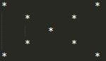
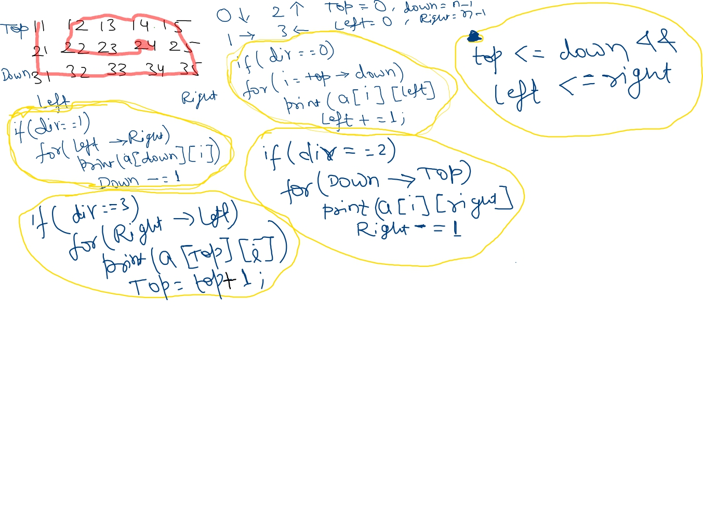
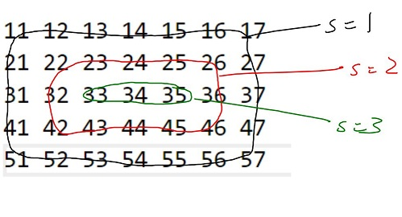

<h1 align="center">DSA Level 1 🔥</h1>

[Getting Started](#getting-started)  
[Patterns](#patterns)  
[Function & Arrays](#function--arrays)  
[2D Arrays](#2d-arrays)  
[String, String Builder and ArrayList](#string-string-builder-and-arraylist)  
<hr/>

[Introduction to Recursion](#introduction-to-recursion)

<hr />
<h2 align="center">Basics of Programming</h2>
<h3 align="center">Getting Started</h3>

**Print Z**  
You are required to print a 'z' of size 5 using '*'.
```java
public class PrintZ {
    public static void main(String[] args) {
        System.out.println("*****");
        System.out.println("   * ");
        System.out.println("  *  ");
        System.out.println(" *   ");
        System.out.println("*****");
    }
}
```

**Grading System**  
1. You are given as input marks of a student.
2. Display an appropriate message based on the following rules:
  	  2.1 for marks above 90, print excellent.
  	  2.2 for marks above 80 and less than equal to 90, print good.
  	  2.3 for marks above 70 and less than equal to 80, print fair.
  	  2.4 for marks above 60 and less than equal to 70, print meets expectations.
  	  2.5 for marks less than equal to 60, print below par.
    
```java
import java.util.*;

public class GradingSystem {
    public static void main(String[] args) {
        Scanner scn = new Scanner(System.in);
        int marks = scn.nextInt();

        if (marks > 90) {
            System.out.println("excellent");
        } else if (marks > 80 && marks <= 90) {
            System.out.println("good");
        } else if (marks > 70 && marks <= 80) {
            System.out.println("fair");
        } else if (marks > 60 && marks <= 70) {
            System.out.println("meets expectations");
        } else {
            System.out.println("below par");
        }
        scn.close();
    }
}
```
**Is A Number Prime**  
1. You've to check whether a given number is prime or not.
2. Take a number "t" as input representing count of input numbers to be tested.
3. Take a number "n" as input "t" number of times.
4. For each input value of n, print "prime" if the number is prime and "not prime" otherwise.
```java
import java.util.*;

public class IsPrime {
    public static void main(String[] args) {
        Scanner scn = new Scanner(System.in);
        int t = scn.nextInt();
        for (int i = 0; i < t; i++) {
            int n = scn.nextInt();
            boolean flag = true;
            for (int j = 2; j * j <= n; j++) {
                if (n % j == 0) {
                    flag = false;
                    break;
                }
            }
            if (flag) {
                System.out.println("prime");
            } else {
                System.out.println("not prime");
            }
        }
        scn.close();
    }
}
```

**Print All Primes Till N**  
1. You've to print all prime numbers between a range. 
2. Take as input "low", the lower limit of range.
3. Take as input "high", the higher limit of range.
4. For the range print all the primes numbers between low and high (both included).
```java
import java.util.*;

public class PrimesTillN {
    public static void main(String[] args) {
        // write your code here
        Scanner sc = new Scanner(System.in);
        int low = sc.nextInt();
        int high = sc.nextInt();
        for (int i = low; i <= high; i++) {
            boolean isPrime = true;
            for (int j = 2; j * j <= i; j++) {
                if (i % j == 0) {
                    isPrime = false;
                    break;
                }
            }
            if (isPrime) {
                System.out.println(i);
            }
        }
        sc.close();
    }
}
```
**Print Fibonacci Numbers Till N**  
1. You've to print first n fibonacci numbers.
2. Take as input "n", the count of fibonacci numbers to print.
3. Print first n fibonacci numbers.
```java
import java.util.*;

public class Fibonacci {
    public static void main(String[] args) {
        int a = 0;
        int b = 1;
        int c = 0;
        Scanner sc = new Scanner(System.in);
        int n = sc.nextInt();
        for (int i = 0; i < n; i++) {
            System.out.println(a);
            c = a + b;
            a = b;
            b = c;
        }
        sc.close();
    }
}
```
**Count Digits In A Number**  
1. You've to count the number of digits in a number.
2. Take as input "n", the number for which the digits has to be counted.
3. Print the digits in that number.

```java
//💡 A Number can tolerate number of division by 10 is equal to the number of digits in the number.
import java.util.*;

public class CountDigit {
    public static void main(String[] args) {
        Scanner sc = new Scanner(System.in);
        int num = sc.nextInt();
        int count = 0;
        while (num > 0) {
            count++;
            num = num / 10;
        }
        System.out.print(count);
        sc.close();
    }
}
```
**Digits Of A Number**  
1. You've to display the digits of a number.
2. Take as input "n", the number for which digits have to be displayed.
3. Print the digits of the number line-wise.
```java
import java.util.*;

public class DigitOfNumber {
    public static void main(String[] args) {
        Scanner sc = new Scanner(System.in);
        int num = sc.nextInt();
        int count = 0;
        int temp = num;
        // Counting number of digits in the number
        while (temp != 0) {
            temp = temp / 10;
            count++;
        }
        // 💡 Calculating divisor, if DigitCount is 5 then we will divide num by 10^4 to
        // get the first digit
        int div = (int) Math.pow(10, count - 1);
        while (div != 0) {
            System.out.println(num / div);
            num = num % div;
            div = div / 10;
        }
        sc.close();
    }
}
```
**Reverse A Number**  
1. You've to display the digits of a number in reverse.
2. Take as input "n", the number for which digits have to be display in reverse.
3. Print the digits of the number line-wise, but in reverse order.
```java
import java.util.*;

public class ReverseNumber {
    public static void main(String[] args) {
        Scanner sc = new Scanner(System.in);
        int num = sc.nextInt();
        while (num > 0) {
            int rem = num % 10;
            System.out.println(rem);
            num = num / 10;
        }
        sc.close();
    }
}
```
**Rotate A Number**  
1. You are given two numbers n and k. You are required to rotate n, k times to the right. If k is positive, rotate to the right i.e. remove rightmost digit and make it leftmost. Do the reverse for negative value of k. Also k can have an absolute value larger than number of digits in n.
2. Take as input n and k.
3. Print the rotated number.
4. Note - Assume that the number of rotations will not cause leading 0's in the result. e.g. such an input will not be given
   n = 12340056,
   k = 3,
   r = 05612340
```java
import java.util.*;

public class RotateNumber {
    public static void main(String[] args) {
        // write your code here
        Scanner sc = new Scanner(System.in);
        int num = sc.nextInt();
        int k = sc.nextInt();
        int temp = num;
        int count = 0;
        while (temp != 0) {
            temp = temp / 10;
            count++;
        }
        // 💡 Rotation is going to repeat itself after DigitCount
        k = k % count;

        // 💡 If K is negative, then we need to rotate to the left instead we are
        // rotating
        // to the right more number of times
        if (k < 0)
            k = k + count;
        while (k != 0) {
            int rem = num % 10;
            int quot = num / 10;
            num = rem * (int) Math.pow(10, count - 1) + quot;
            k--;
        }
        System.out.print(num);
        sc.close();
    }
}
```
**Inverse Of A Number**  
1. You are given a number following certain constraints.
2. The key constraint is if the number is 5 digits long, it'll contain all the digits from 1 to 5 without missing any and without repeating any. e.g. 23415 is a 5 digit long number containing all digits from 1 to 5 without missing and repeating any digit from 1 to 5.Take a look at few other valid numbers - 624135, 81456273 etc.Here are a few invalid numbers - 139, 7421357 etc.
3. The inverse of a number is defined as the number created by interchanging the face value and index of digits of number.e.g. for 426135 (reading from right to left, 5 is in place 1, 3 is in place 2, 1 is in place 3, 6 is in place 4, 2 is in place 5 and 4 is in place 6), the inverse will be 416253 (reading from right to left, 3 is in place 1, 5 is in place 2,2 is in place 3, 6 is in place 4, 1 is in place 5 and 4 is in place 6) More examples - inverse of 2134 is 1243 and inverse of 24153 is 24153    
4. Take as input number "n", assume that the number will follow constraints.
5. Print it's inverse.
```java
import java.util.*;

public class InverseOfaNumber {
    public static void main(String[] args) {
        Scanner sc = new Scanner(System.in);
        int num = sc.nextInt();
        int position = 1;
        int inverseNum = 0;
        while (num != 0) {
            int lastDigit = num % 10;
            num = num / 10;
            inverseNum = inverseNum + (position * (int) Math.pow(10, lastDigit - 1));
            position++;
        }
        System.out.print(inverseNum);
        sc.close();
    }
}
```
**Gcd And Lcm**  
1. You are required to print the Greatest Common Divisor (GCD) of two numbers.
2. You are also required to print the Lowest Common Multiple (LCM) of the same numbers.
3. Take input "num1" and "num2" as the two numbers.
4. Print their GCD and LCM.
```java
import java.util.*;

public class GcdAndLcm {
    public static void main(String[] args) {
        // write your code here
        Scanner sc = new Scanner(System.in);
        int num1 = sc.nextInt();
        int num2 = sc.nextInt();
        int temp1 = num1;
        int temp2 = num2;
        // 💡 GCD: Divide until remainder is 0, and in each iteration remainder will
        // become divisor & divisor will become dividend.
        // 💡 At last remainder i.e. num2 which successfully divides the num1 will be
        // the GCD.
        while (num1 % num2 != 0) {
            int rem = num1 % num2;
            num1 = num2;
            num2 = rem;
        }
        System.out.println(num2);
        System.out.println((temp1 * temp2) / num2);
        sc.close();
    }
}
```
**Prime Factorization Of A Number**  
1. You are required to display the prime factorization of a number.
2. Take as input a number n.
3. Print all its prime factors from smallest to largest.
```java
import java.util.*;

public class PrimeFactorization {

    public static void main(String[] args) {
        // write your code here
        Scanner sc = new Scanner(System.in);
        int num = sc.nextInt();
        for (int i = 2; i * i < num; i++) {
            while (num % i == 0) {
                System.out.print(i + " ");
                num = num / i;
            }
        }
        if (num > 1)
            System.out.print(num);
        sc.close();
    }
}
```
**The Curious Case Of Benjamin Bulbs**  
1. You are given n number of bulbs. They are all switched off. A weird fluctuation in voltage hits the circuit n times. In the 1st fluctuation all bulbs are toggled, in the 2nd fluctuation every 2nd bulb is toggled, in the 3rd fluctuation every 3rd bulb is toggled and so on. You've to find which bulbs will be switched on after n fluctuations.
2. Take as input a number n, representing the number of bulbs.
3. Print all the bulbs that will be on after the nth fluctuation in voltage.
```java
import java.util.*;

public class BenjaminBulbs {
    public static void main(String[] args) {
        Scanner sc = new Scanner(System.in);
        int num = sc.nextInt();
        for (int i = 1; i * i <= num; i++) {
            System.out.println(i * i);
        }
        sc.close();
    }
}
```
**Pythagorean Triplet**  
1. You are required to check if a given set of numbers is a valid pythagorean triplet.
2. Take as input three numbers a, b and c.
3. Print true if they can form a pythagorean triplet and false otherwise.
```java
import java.util.*;

public class PythagoreanTriplet {
    public static void main(String[] args) {
        Scanner sc = new Scanner(System.in);
        int a = sc.nextInt();
        int b = sc.nextInt();
        int c = sc.nextInt();
        System.out.println(a * a + b * b == c * c || a * a + c * c == b * b || b * b + c * c == a * a);
        sc.close();
    }
}
```
**Max Min 2**  
You are given an array A of n unique integers.
You have to find 2nd maximum and 2nd minimum numbers in this array.

If A = [3, 7, -1, 2, 4, 9]

2nd max is 7
2nd min is 2
```java
// 💡 In the first traversal find the maximum element.
// In the second traversal find the greatest element in the remaining excluding
// the previous greatest.

import java.util.*;

public class MaxMin2 {
    public static void main(String[] args) throws Exception {
        Scanner sc = new Scanner(System.in);
        int arrSize = sc.nextInt();
        int[] arr = new int[arrSize];
        // taking array input
        for (int i = 0; i < arrSize; i++) {
            arr[i] = sc.nextInt();
        }
        // Calculate Maximum
        int max = arr[0];
        for (int j = 0; j < arrSize; j++) {
            if (arr[j] > max) {
                max = arr[j];
            }
        }
        // Calculate Minimum
        int min = arr[0];
        for (int k = 0; k < arrSize; k++) {
            if (arr[k] < min) {
                min = arr[k];
            }
        }
        // Calculate 2nd Max
        int secondMax = arr[0];
        for (int l = 0; l < arrSize; l++) {
            if (arr[l] != max && arr[l] > secondMax) {
                secondMax = arr[l];
            }
        }
        // Calculate 2nd Min
        int secondMin = arr[0];
        for (int m = 0; m < arrSize; m++) {
            if (arr[m] != min && arr[m] < secondMin) {
                secondMin = arr[m];
            }
        }
        System.out.print(secondMax + " " + secondMin);
        sc.close();
    }
}
```
**Largest Number**
You are given an array of N positive integers which represent digits of a number.  
You have to form the largest number possible after performing an operation exactly once. The operation is -  
Select two indices a and b, and swap their values.
Print the largest number formed.
```java
// TODO
```

<hr>
<h3 align="center">Patterns</h3>

**Pattern 1**  

```java
import java.util.*;

public class PatternOne {
    public static void main(String[] args) {
        Scanner scn = new Scanner(System.in);
        int n = scn.nextInt();
        for (int i = 1; i <= n; i++) {
            for (int j = 1; j <= i; j++) {
                System.out.print("*" + "	");
            }
            System.out.println("");
        }
        scn.close();
    }
}
```
**Pattern 2**  

```java
import java.util.*;

public class PatternTwo {
    public static void main(String[] args) {
        Scanner scn = new Scanner(System.in);
        int n = scn.nextInt();
        for (int i = 1; i <= n; i++) {
            for (int j = 1; j <= n - i + 1; j++) {
                System.out.print("*" + "	");
            }
            System.out.println("");
        }
        scn.close();
    }
}
```
**Pattern 3**  

```java
import java.util.*;

public class PatternThree {
    public static void main(String[] args) {
        Scanner scn = new Scanner(System.in);
        int n = scn.nextInt();
        for (int i = 1; i <= n; i++) {
            for (int j = 1; j <= (n - i); j++) {
                System.out.print("" + "	");
            }
            for (int k = 1; k <= i; k++) {
                System.out.print("*" + "	");
            }
            System.out.println("");
        }
        scn.close();
    }
}
```
**Pattern 4**  

```java
import java.util.*;

public class PatternFour {
    public static void main(String[] args) {
        Scanner scn = new Scanner(System.in);
        int n = scn.nextInt();
        for (int i = 1; i <= n; i++) {
            for (int j = 1; j <= i - 1; j++) {
                System.out.print("	");
            }
            for (int j = 1; j <= n - i + 1; j++) {
                System.out.print("*	");
            }
            System.out.println("");
        }
        scn.close();
    }
}
```
**Pattern 5**  

```java
import java.util.*;

public class PatternFive {
    public static void main(String[] args) {
        Scanner scn = new Scanner(System.in);
        int n = scn.nextInt();
        for (int i = 1; i <= n / 2 + 1; i++) {
            for (int j = 1; j <= (n / 2) - i + 1; j++) {
                System.out.print("	");
            }
            for (int j = 1; j <= 2 * i - 1; j++) {
                System.out.print("*	");
            }
            System.out.println();
        }
        for (int i = 1; i <= n / 2; i++) {
            for (int j = 1; j <= i; j++) {
                System.out.print("	");
            }
            for (int j = 1; j <= n - (2 * i); j++) {
                System.out.print("*	");
            }
            System.out.println();
        }
        scn.close();
    }
}
```
**Pattern 6**  

```java
import java.util.*;

public class PatternSix {
    public static void main(String[] args) {
        Scanner scn = new Scanner(System.in);
        int n = scn.nextInt();
        for (int i = 1; i <= n / 2 + 1; i++) {
            // T1 - *
            for (int j = 1; j <= n / 2 + 2 - i; j++) {
                System.out.print("*	");
            }
            // T2 -
            for (int j = 1; j <= 2 * i - 1; j++) {
                System.out.print("	");
            }
            // T3 - *
            for (int j = 1; j <= n / 2 + 2 - i; j++) {
                System.out.print("*	");
            }
            System.out.println();
        }
        for (int i = 1; i <= n / 2; i++) {
            // T1 - *
            for (int j = 1; j <= i + 1; j++) {
                System.out.print("*	");
            }
            // T2 -
            for (int j = 1; j <= n - 2 * i; j++) {
                System.out.print("	");
            }
            // T3 - *
            for (int j = 1; j <= i + 1; j++) {
                System.out.print("*	");
            }
            System.out.println();
        }
        scn.close();
    }
}
```
**Pattern 7**  

```java
import java.util.*;

public class PatternSeven {
    public static void main(String[] args) {
        Scanner scn = new Scanner(System.in);
        int n = scn.nextInt();
        for (int i = 1; i <= n; i++) {
            for (int j = 1; j <= i - 1; j++) {
                System.out.print("	");
            }
            System.out.println("*");
        }
        scn.close();
    }
}
```
**Pattern 8**  

```java
import java.util.*;

public class PatternEight {
    public static void main(String[] args) {
        Scanner scn = new Scanner(System.in);
        int n = scn.nextInt();
        for (int i = 1; i <= n; i++) {
            for (int j = 1; j <= n - i; j++) {
                System.out.print("	");
            }
            System.out.println("*");
        }
        scn.close();
    }
}
```
**Pattern 9**  

```java
import java.util.*;

public class PatternNine {
    public static void main(String[] args) {
        Scanner scn = new Scanner(System.in);
        int n = scn.nextInt();
        for (int i = 1; i <= n; i++) {
            for (int j = 1; j <= n; j++) {
                if (i == j || i + j == n + 1) {
                    System.out.print("*	");
                } else {
                    System.out.print("	");
                }
            }
            System.out.println();
        }
        scn.close();
    }
}
```
**Pattern 10**  

```java
// TODO
```
**Pattern 11**  

```java
import java.util.*;

public class PatternEleven {
    public static void main(String[] args) {
        Scanner scn = new Scanner(System.in);
        int n = scn.nextInt();
        int nst = 1;
        int val = 1;
        for (int i = 1; i <= n; i++) {
            for (int j = 1; j <= nst; j++) {
                System.out.print(val + "	");
                val++;
            }
            System.out.println();
            nst++;
        }
        scn.close();
    }
}

```
**Pattern 12**  

```java
// TODO
```
**Pattern 13**  

```java
// TODO
```
**Pattern 14**  

```java
// TODO
```
**Pattern 15**  

```java
// TODO
```
**Pattern 16**  

```java
// TODO
```
**Pattern 17**  

```java
// TODO
```
**Pattern 18**  

```java
// TODO
```
**Pattern 19**  

```java
// TODO
```
**Pattern 20**  

```java
// TODO
```

<hr>
<h3 align="center">Function & Arrays</h3>

**Digit Frequency**
1. You are given a number n.
2. You are given a digit d.
3. You are required to calculate the frequency of digit d in number n.
```java
import java.util.Scanner;

public class DigitFrequency {
    public static void main(String[] args) {
        Scanner scn = new Scanner(System.in);
        int n = scn.nextInt();
        int d = scn.nextInt();
        int f = getDigitFrequency(n, d);
        System.out.println(f);
        scn.close();
    }

    public static int getDigitFrequency(int n, int d) {
        int count = 0;
        while (n > 0) {
            int rem = n % 10;
            if (rem == d)
                count++;
            n = n / 10;
        }
        return count;
    }
}
```
**Decimal To Any Base**
1. You are given a decimal number n.
2. You are given a base b.
3. You are required to convert the number n into its corresponding value in base b.
```java
// 💡 Note: We will keep dividing number by target base until it is zero & in each iteration we will add the remainder*multiplier to the result. 
// We are multiplying the multiplier by 10 because we need to collect remainder in reverse order.

import java.util.*;

public class DecimalToAnyBase {
    public static void main(String[] args) {
        Scanner scn = new Scanner(System.in);
        int n = scn.nextInt();
        int b = scn.nextInt();
        int dn = getValueInBase(n, b);
        System.out.println(dn);
        scn.close();
    }
    public static int getValueInBase(int n, int b) {
        int multiplier = 1; // 10^0 = 1;
        int result = 0;
        while (n != 0) {
            int rem = n % b;
            n = n / b;
            // Add the remainder to the result after multiplying it with the multiplier(to
            // get result in reverse)
            result += rem * multiplier;
            multiplier *= 10;
        }
        return result;
    }
}
```
**Any Base To Decimal**
1. You are given a number n.
2. You are given a base b. n is a number on base b.
3. You are required to convert the number n into its corresponding value in decimal number system.
```java
// 💡 To convert number in decimal, divide the number by 10 and keep the remainder. 
// Now, multiply the remainder by base^0 and add it to the result. 
// In every iteration, reduce the num to num/10 & increase the multiplier by *base i.e. base^1, base^2 and keep adding to result.
// Repeat this until number become zero.

import java.util.*;

public class AnyBaseToDecimal {

    public static void main(String[] args) {
        Scanner scn = new Scanner(System.in);
        int n = scn.nextInt();
        int b = scn.nextInt();
        int d = getValueInDecimal(n, b);
        System.out.println(d);
        scn.close();
    }
    public static int getValueInDecimal(int n, int b) {
        int result = 0;
        int initialMultiplier = 1; // base^0
        while (n != 0) {
            int rem = n % 10;
            n = n / 10;
            result += rem * initialMultiplier;
            initialMultiplier *= b;
        }
        return result;
    }
}
```
**Any Base To Any Base**
1. You are given a number n.
2. You are given a base b1. n is a number on base b.
3. You are given another base b2.
4. You are required to convert the number n of base b1 to a number in base b2.
```java
// 💡 Note: First convert to Decimal and then convert to any base.

import java.util.*;

public class AnyBaseToAnyBase {

    public static void main(String[] args) {
        Scanner scn = new Scanner(System.in);
        int n = scn.nextInt();
        int sourceBase = scn.nextInt();
        int destBase = scn.nextInt();
        int numberInDecimal = convertToDecimal(n, sourceBase);
        int numberInDestinationBase = decimalToAnyBase(numberInDecimal, destBase);
        System.out.print(numberInDestinationBase);
        scn.close();
    }

    public static int convertToDecimal(int n, int b) {
        // write your code here
        int result = 0;
        int initialMultiplier = 1; // base^0
        while (n != 0) {
            int rem = n % 10;
            n = n / 10;
            result += rem * initialMultiplier;
            initialMultiplier *= b;
        }
        return result;
    }

    public static int decimalToAnyBase(int n, int b) {
        int multiplier = 1; // 10^0 = 1;
        int result = 0;
        while (n != 0) {
            int rem = n % b;
            n = n / b;
            // Add the remainder to the result after multiplying it with the multiplier(to
            // get result in reverse)
            result += rem * multiplier;
            multiplier *= 10;
        }
        return result;
    }
}
```
**Any Base Addition**
1. You are given a base b.
2. You are given two numbers n1 and n2 of base b.
3. You are required to add the two numbers and print their value in base b.
```java
// Brute force solution would be to convert the nums to decimal base then add and then convert back to base b.
import java.util.*;

public class AnyBaseAddition {
    public static void main(String[] args) {
        Scanner scn = new Scanner(System.in);
        int b = scn.nextInt();
        int n1 = scn.nextInt();
        int n2 = scn.nextInt();

        int d = getSum(b, n1, n2);
        System.out.println(d);
        scn.close();
    }
    // 💡 if base is 8 and on addition, 10 comes up then its Q: 1, R: 2
    public static int getSum(int b, int n1, int n2) {
        int result = 0;
        int sum = 0, carry = 0, multiplier = 1;
        while (n1 > 0 || n2 > 0 || carry > 0) {
            int digit1 = n1 % 10;
            int digit2 = n2 % 10;
            sum = (digit1 + digit2 + carry);
            carry = sum / b;
            int value = sum % b;

            result += multiplier * value;
            // increase multiplier to print the number
            multiplier *= 10;

            n1 /= 10;
            n2 /= 10;
        }
        return result;
    }
}
```
**Any Base Subtraction**
1. You are given a base b.
2. You are given two numbers n1 and n2 of base b.
3. You are required to subtract n1 from n2 and print the value.
```java
import java.io.*;
import java.util.*;

public class Main {
  public static void main(String[] args) {
    Scanner scn = new Scanner(System.in);
    int b = scn.nextInt();
    int n1 = scn.nextInt();
    int n2 = scn.nextInt();
    int d = getDifference(b, n1, n2);
    System.out.println(d);
  }

  public static int getDifference(int b, int n1, int n2) {
    int result = 0;
    int carry = 0;
    int power = 1;

    while (n2 > 0) {
      int digit1 = n1 % 10;
      int digit2 = n2 % 10;
      // reducing number
      n1 = n1 / 10;
      n2 = n2 / 10;
      // We have to do digit2 - digit1
      int diff = 0;
      // add (borrow) if any carry is there
      digit2 = digit2 + carry;
      // if digit2 is greater simply subtract and carry diff
      if (digit2 >= digit1) {
        carry = 0;
        diff = digit2 - digit1;
      } else {
        // if digit2 is smaller simply take carry 1 and assign -1 and 1 carry is equal to base add
        carry = -1;
        diff = digit2 + b - digit1;
      }
      result += diff * power;
      power = power * 10;
    }
    return result;
  }
}
```
**Any Base Multiplication**
1. You are given a base b.
2. You are given two numbers n1 and n2 of base b.
3. You are required to multiply n1 and n2 and print the value.
```java
import java.util.*;

public class AnyBaseMultiplication {

    public static void main(String[] args) {
        Scanner scn = new Scanner(System.in);
        int b = scn.nextInt();
        int n1 = scn.nextInt();
        int n2 = scn.nextInt();

        int d = getProduct(b, n1, n2);
        System.out.println(d);
        scn.close();
    }

    public static int getProduct(int b, int n1, int n2) {
        // power is to form result by extending single digit aka align
        int p = 1;
        int result = 0;
        while (n2 > 0) {
            int d2 = n2 % 10;
            n2 = n2 / 10;
            int singleProduct = getProductWithSingleDigit(b, n1, d2);
            result = getSum(b, result, singleProduct * p);
            p = p * 10;
        }
        return result;
    }

    public static int getProductWithSingleDigit(int b, int n1, int d2) {
        // In loop extract single digit of n1 & multiply with d2
        int result = 0;
        int carry = 0;
        int power = 1;

        while (n1 > 0 || carry > 0) {
            int d1 = n1 % 10;
            n1 = n1 / 10;

            int d = d1 * d2 + carry;
            carry = d / b;
            d = d % b;

            result += d * power;
            // Power is to form result
            power *= 10;
        }
        return result;
    }

    // 💡 if base is 8 and on addition, 10 comes up then its Q: 1, R: 2
    public static int getSum(int b, int n1, int n2) {
        int result = 0;
        int sum = 0, carry = 0, multiplier = 1;
        while (n1 > 0 || n2 > 0 || carry > 0) {
            int digit1 = n1 % 10;
            int digit2 = n2 % 10;
            sum = (digit1 + digit2 + carry);
            carry = sum / b;
            int value = sum % b;

            result += multiplier * value;
            // increase multiplier to print the number
            multiplier *= 10;

            n1 /= 10;
            n2 /= 10;
        }
        return result;
    }
}
```
**Span Of Array**
1. You are given a number n, representing the count of elements.
2. You are given n numbers.
3. You are required to find the span of input. Span is defined as difference of maximum value and minimum value.
```java
import java.util.*;

public class SpanOfArray {
    public static void main(String[] args) throws Exception {
        // Input Array
        Scanner sc = new Scanner(System.in);
        int arrSize = sc.nextInt();
        int[] arr = new int[arrSize];
        for (int i = 0; i < arrSize; i++) {
            arr[i] = sc.nextInt();
        }
        // Finding Maximum
        int max = arr[0];
        for (int j = 0; j < arrSize; j++) {
            if (arr[j] > max) {
                max = arr[j];
            }
        }
        // Finding Minimum
        int min = arr[0];
        for (int k = 0; k < arrSize; k++) {
            if (arr[k] < min) {
                min = arr[k];
            }
        }
        // Calculating Spam
        System.out.print(max - min);
        sc.close();
    }

}
```
**Find Element In An Array**
1. You are given a number n, representing the size of array a.
2. You are given n distinct numbers, representing elements of array a.
3. You are given another number d.
4. You are required to check if d number exists in the array a and at what index (0 based). If found print the index, otherwise print -1.
```java
import java.util.*;

public class FindElementIndex {
    public static void main(String[] args) throws Exception {
        // Input Array  
        Scanner sc = new Scanner(System.in);
        int arrSize = sc.nextInt();
        int[] arr = new int[arrSize];
        for (int i = 0; i < arrSize; i++) {
            arr[i] = sc.nextInt();
        }
        int toSearch = sc.nextInt();
        int result = -1;
        for (int j = 0; j < arrSize; j++) {
            if (arr[j] == toSearch) {
                result = j;
                break;
            }
        }
        sc.close();
        System.out.print(result);
    }

}
```
**Bar Chart**
1. You are given a number n, representing the size of array a.
2. You are given n numbers, representing elements of array a.
3. You are required to print a bar chart representing value of arr a.
```java
import java.util.*;

public class BarChart {
    public static void main(String[] args) throws Exception {
        // Input Array
        Scanner sc = new Scanner(System.in);
        int arrSize = sc.nextInt();
        int[] arr = new int[arrSize];
        for (int i = 0; i < arrSize; i++) {
            arr[i] = sc.nextInt();
        }
        // Finding Maximum
        int max = arr[0];
        for (int j = 0; j < arrSize; j++) {
            if (arr[j] > max) {
                max = arr[j];
            }
        }
        // 💡 Draw Pattern, Imagine it be like buildings with max being the tallest
        // building.
        // Start iterating, if elem match the height print * else space.
        // decrease height in each iteration
        for (int height = max; height >= 1; height--) {
            for (int i = 0; i < arrSize; i++) {
                if (arr[i] >= height) {
                    System.out.print("*\t");
                } else {
                    System.out.print("\t");
                }
            }
            System.out.println();
        }
        sc.close();
    }
}
```
**Sum Of Two Arrays**
1. You are given a number n1, representing the size of array a1.
2. You are given n1 numbers, representing elements of array a1.
3. You are given a number n2, representing the size of array a2.
4. You are given n2 numbers, representing elements of array a2.
5. The two arrays represent digits of two numbers.
6. You are required to add the numbers represented by two arrays and print the arrays.
```java
import java.util.*;

public class ArraySum {
    public static void main(String[] args) {
        Scanner scanner = new Scanner(System.in);
        int n1 = scanner.nextInt();
        int[] arr1 = new int[n1];
        for (int i = 0; i < arr1.length; i++) {
            arr1[i] = scanner.nextInt();
        }
        int n2 = scanner.nextInt();
        int[] arr2 = new int[n2];
        for (int i = 0; i < arr2.length; i++) {
            arr2[i] = scanner.nextInt();
        }
        int[] sum = new int[n1 > n2 ? n1 : n2];
        int carry = 0;
        int i = arr1.length - 1;
        int j = arr2.length - 1;
        int k = sum.length - 1;
        while (k >= 0) {
            int digit = carry;
            if (i >= 0) {
                digit += arr1[i];
                i--;
            }
            if (j >= 0) {
                digit += arr2[j];
                j--;
            }
            // after summation if num > 10, then remainder will be added to result array and
            // carry will be set to quotient
            sum[k] = digit % 10;
            carry = digit / 10;
            k--;
        }
        if (carry != 0) {
            System.out.println(carry);
        }
        for (int val : sum) {
            System.out.println(val);
        }
        scanner.close();
    }
}
```
**Difference Of Two Arrays**
1. You are given a number n1, representing the size of array a1.
2. You are given n1 numbers, representing elements of array a1.
3. You are given a number n2, representing the size of array a2.
4. You are given n2 numbers, representing elements of array a2.
5. The two arrays represent digits of two numbers.
6. You are required to find the difference of two numbers represented by two arrays and print the arrays. a2 - a1
Assumption - number represented by a2 is greater.
```java
import java.util.*;

public class ArrayDiff {
    public static void main(String[] args) throws Exception {
        Scanner scn = new Scanner(System.in);

        int n1 = scn.nextInt();
        int array1[] = new int[n1];
        for (int i = 0; i < array1.length; i++) {
            array1[i] = scn.nextInt();
        }

        int n2 = scn.nextInt();
        int array2[] = new int[n2];
        for (int i = 0; i < array2.length; i++) {
            array2[i] = scn.nextInt();
        }

        int diff[] = new int[n2];
        int carry = 0;
        int i = array1.length - 1;
        int j = array2.length - 1;
        int k = diff.length - 1;

        while (k >= 0) {
            int currentDiff = 0;
            // If smaller array is exhausted
            int tempVal = (i >= 0 ? array1[i] : 0);
            if (array2[j] + carry >= tempVal) {
                currentDiff = array2[j] + carry - tempVal;
                carry = 0;
            } else {
                currentDiff = array2[j] + 10 + carry - tempVal;
                carry = -1;
            }
            diff[k] = currentDiff;
            i--;
            j--;
            k--;
        }
        int index = 0;
        while (index < diff.length && diff[index] == 0) {
            index++;
        }
        while (index < diff.length) {
            System.out.println(diff[index++]);
        }
        scn.close();
    }
}
```
**Reverse An Array**
1. You are given a number n, representing the size of array a.
2. You are given n numbers, representing elements of array a.
3. You are required to reverse the contents of array a.
```java
import java.io.*;

public class ReverseArray {
    public static void display(int[] a) {
        StringBuilder sb = new StringBuilder();
        for (int val : a) {
            sb.append(val + " ");
        }
        System.out.println(sb);
    }
    public static void reverse(int[] a) {
        int left = 0;
        int right = a.length - 1;
        while (left <= right) {
            int temp = a[left];
            a[left] = a[right];
            a[right] = temp;
            left++;
            right--;
        }
    }
    public static void main(String[] args) throws Exception {
        BufferedReader br = new BufferedReader(new InputStreamReader(System.in));
        int n = Integer.parseInt(br.readLine());
        int[] a = new int[n];
        for (int i = 0; i < n; i++) {
            a[i] = Integer.parseInt(br.readLine());
        }
        reverse(a);
        display(a);
    }

}
```
**Rotate An Array**
1. You are given a number n, representing the size of array a.
2. You are given n numbers, representing elements of array a.
3. You are given a number k.
4. Rotate the array a, k times to the right (for positive values of k), and to the left for negative values of k.
```java
// 💡 Pseudo Code
// * Deciding K Value: If the value of K is positive, K=K%N where N is the length of the input array. If the value of K is negative, K=K%N + N.
// * Revering Parts of Array: After we have calculated the value of K, reverse the first part of the array i.e. from 0 to N-K-1 and the second part from N-K to N-1 separately.
// * Reverse the entire Array: Now, reverse the entire array i.e. from 0 to N-1. The array will be rotated according to the value of K.
import java.io.*;

public class RotateArray {
    public static void display(int[] a) {
        StringBuilder sb = new StringBuilder();

        for (int val : a) {
            sb.append(val + " ");
        }
        System.out.println(sb);
    }

    public static void reverse(int[] a, int li, int ri) {
        while (li < ri) {
            int temp = a[li];
            a[li] = a[ri];
            a[ri] = temp;
            li++;
            ri--;
        }
    }

    public static void rotate(int[] a, int k) {
        // After a length rotation result will be same
        k = k % a.length;
        // If negative, we will handle with positive value
        if (k < 0) {
            k += a.length;
        }
        // Break into two part, P1 & P2
        // Reverse P1 & P2 separately
        // Now do overall reverse of resultant
        // Eg: 1 2 3 4 5 6 7 8, k = 3
        // P1 = 1 2 3 4 5 -> P1' = 5 4 3 2 1
        // P2 = 6 7 8 -> P2' = 8 7 6
        // Resultant = 5 4 3 2 1 8 7 6
        // Final Reverse = 6 7 8 1 2 3 4 5

        // Reversing Part 1
        reverse(a, 0, a.length - k - 1);
        // Reversing Part 2
        reverse(a, a.length - k, a.length - 1);
        // Overall reverse
        reverse(a, 0, a.length - 1);
    }
    public static void main(String[] args) throws Exception {
        BufferedReader br = new BufferedReader(new InputStreamReader(System.in));

        int n = Integer.parseInt(br.readLine());
        int[] a = new int[n];
        for (int i = 0; i < n; i++) {
            a[i] = Integer.parseInt(br.readLine());
        }
        int k = Integer.parseInt(br.readLine());
        rotate(a, k);
        display(a);
    }
}
```
**Inverse of An Array**
1. You are given a number n, representing the size of array a.
2. You are given n numbers, representing elements of array a.
3. You are required to calculate the inverse of array a.

For definition and constraints check this link
https://www.pepcoding.com/resources/online-java-foundation/getting-started/inverse-of-a-number/ojquestion
The only difference is the range of values is from 0 to n - 1, instead of 1 to n.
```java
// if at ith position value v is present then in result array at vth position i will be present
import java.io.*;

public class InverseArray {
    public static void display(int[] a) {
        StringBuilder sb = new StringBuilder();

        for (int val : a) {
            sb.append(val + "\n");
        }
        System.out.println(sb);
    }
    public static int[] inverse(int[] a) {
        int[] inv = new int[a.length];
        for (int i = 0; i < a.length; i++) {
            int val = a[i];
            inv[val] = i;
        }
        return inv;
    }
    public static void main(String[] args) throws Exception {
        BufferedReader br = new BufferedReader(new InputStreamReader(System.in));

        int n = Integer.parseInt(br.readLine());
        int[] a = new int[n];
        for (int i = 0; i < n; i++) {
            a[i] = Integer.parseInt(br.readLine());
        }
        int[] inv = inverse(a);
        display(inv);
    }
}
```
**SubArray Problem**
1. You are given an array of size 'n' and n elements of the same array.
2. You are required to find and print all the subarrays of the given array. 
3. Each subarray should be space seperated and on a seperate lines. Refer to sample input and output.
```java
import java.util.*;

public class SubArray {
    public static void main(String[] args) throws Exception {
        Scanner scn = new Scanner(System.in);
        int n = scn.nextInt();
        int[] arr = new int[n];
        for (int i = 0; i < n; i++) {
            arr[i] = scn.nextInt();
        }
        for (int i = 0; i < arr.length; i++) {
            for (int j = i; j < arr.length; j++) {
                for (int k = i; k <= j; k++) {
                    System.out.print(arr[k] + "	");
                }
                System.out.println();
            }
        }
        scn.close();
    }
}
```
**Subsets Of Array**
1. You are given a number n, representing the count of elements.
2. You are given n numbers.
3. You are required to print all subsets of arr. Each subset should be on separate line. For more clarity check out sample input and output.
```java
import java.util.*;

public class SubSetOfArray {
    public static void main(String[] args) throws Exception {
        Scanner scn = new Scanner(System.in);
        int n = scn.nextInt();
        int[] arr = new int[n];
        for (int i = 0; i < arr.length; i++) {
            arr[i] = scn.nextInt();
        }
        // calculating the number of subsets
        int limit = (int) Math.pow(2, arr.length);
        for (int i = 0; i < limit; i++) {
            // 💡 Convert i to binary and use 0's and 1's to check if an array's element is
            // to be printed or not
            String set = "";
            // we make use of set to print in required order
            int temp = i;
            // we store i because we need to use value
            // of i without manipulating the actual i
            // as i is the outer loop iterator
            for (int j = arr.length - 1; j >= 0; j--) {
                // calculating the binary, extracting //
                // the remainder one and by one
                // and putting required element
                // in the String to be printed.
                int rem = temp % 2;
                temp = temp / 2;
                if (rem == 0) // nothing to be printed
                {
                    set = "-\t" + set;
                } else {
                    // we print the element, so we add it to our answer string
                    set = arr[j] + "\t" + set;
                }
            }
            // printing the required pattern line-by-line
            System.out.println(set);
        }
        scn.close();
    }
}
```
**Broken Economy**  
In a country of novice government, the economic system is changed where only coins are used that too of various denominations. Whenever a foreigner visits this country, they visit a money exchanger to get the currency of the same country. As the foreigner is unaware of the denomination of the country, the money exchange prefers to tell them the denomination which is the nearest maximum and nearest minimum to the denomination mentioned by the foreigner. In case they get the correct guess of the denomination, they are told the same denomination. The denominations are always quoted in ascending order.

Example 1: In a country, 8 given denominations are as follows
[5, 10, 15, 22, 33, 40, 42, 55]

The foreigner asks for denomination 25.
The money exchange tells them that denominations of 33 and 22 are available.

Example 2: 
In a country, 5 given denominations are as follows
[7, 14, 18, 25, 30]

The foreigner asks for the denomination of 18.

The money exchange tells them a denomination of 18 is available.  

You are required to print the values told by the money exchange to the foreigner.

1. You are given a number n, representing the size of array a.
2. You are given n numbers, representing elements of the array a.
3. You are given another number d.
4. You are required to find the ceil and floor of d in array a.
```java
import java.util.*;

public class BrokenEconomy {
    public static void main(String[] args) {
        Scanner scn = new Scanner(System.in);
        int n = scn.nextInt();
        int[] arr = new int[n];
        for (int i = 0; i < n; i++) {
            arr[i] = scn.nextInt();
        }
        // low decide floor; high decide ceil
        int low = 0;
        int high = arr.length - 1;
        int data = scn.nextInt();
        int ceil = Integer.MAX_VALUE;
        int floor = Integer.MIN_VALUE;
        while (low <= high) {
            int mid = (low + high) / 2;
            if (data < arr[mid]) {
                high = mid - 1;
                ceil = arr[mid];
            } else if (data > arr[mid]) {
                low = mid + 1;
                floor = arr[mid];
            } else {
                ceil = floor = arr[mid];
                break;
            }
        }
        scn.close();
        System.out.println(ceil);
        System.out.println(floor);
    }
}
```
**First Index And Last Index**
1. You are given a number n, representing the size of array a.
2. You are given n numbers, representing elements of array a.

Assumption - Array is sorted. Array may have duplicate values.
```java
import java.io.*;

public class FirstIndexLastIndex {
    public static void main(String[] args) throws Exception {
        BufferedReader br = new BufferedReader(new InputStreamReader(System.in));
        int n = Integer.parseInt(br.readLine());
        int[] arr = new int[n];
        for (int i = 0; i < n; i++) {
            arr[i] = Integer.parseInt(br.readLine());
        }
        int data = Integer.parseInt(br.readLine());

        int left = 0;
        int right = arr.length - 1;
        int fi = -1; // First index = fi

        while (left <= right) {
            int mid = (left + right) / 2;
            if (data > arr[mid]) {
                left = mid + 1;
            } else if (data < arr[mid]) {
                right = mid - 1;
            } else {
                fi = mid;
                right = mid - 1;
            }
        }

        left = 0;
        right = arr.length - 1;
        int li = -1; // last index = li
        while (left <= right) {
            int mid = (left + right) / 2;
            if (data > arr[mid]) {
                left = mid + 1;
            } else if (data < arr[mid]) {
                right = mid - 1;
            } else {
                li = mid;
                left = mid + 1;
            }
        }

        System.out.println(fi);
        System.out.println(li);
    }
}
```

<hr>
<h3 align="center">2D Arrays</h3>

**2d Arrays Demo**
1. You are given a number n, representing the number of rows.
2. You are given a number m, representing the number of columns.
3. You are given n*m numbers, representing elements of 2d array a.
4. You are required to display the contents of 2d array as suggested by output format below.
```java
import java.util.*;

public class Demo{
    public static void main(String[] args) throws Exception {
        Scanner sc = new Scanner(System.in);
        int row = sc.nextInt();
        int col = sc.nextInt();
        int[][] arr = new int[row][col];
        for (int i = 0; i < arr.length; i++) {
        for (int j = 0; j < arr[0].length; j++) {
            arr[i][j] = sc.nextInt();
        }  
        }
        for (int i = 0; i < arr.length; i++) {
        for (int j = 0; j < arr[0].length; j++) {
            System.out.print(arr[i][j] + " ");
        }
        System.out.println();
        }
    }
}
```
**Matrix Multiplication**
1. You are given a number n1, representing the number of rows of 1st matrix.
2. You are given a number m1, representing the number of columns of 1st matrix.
3. You are given n1*m1 numbers, representing elements of 2d array a1.
4. You are given a number n2, representing the number of rows of 2nd matrix.
5. You are given a number m2, representing the number of columns of 2nd matrix.
6. You are given n2*m2 numbers, representing elements of 2d array a2.
7. If the two arrays representing two matrices of dimensions n1 * m1 and n2 * m2 can be multiplied, display the contents of prd array as specified in output Format.
8. If the two arrays can't be multiplied, print "Invalid input".
```java
import java.util.*;

public class ArrayMultiplication {
    public static void main(String[] args) throws Exception {
        Scanner scn = new Scanner(System.in);
        int row1 = scn.nextInt();
        int col1 = scn.nextInt();
        // Input 1st 2D Array
        int[][] arr1 = new int[row1][col1];
        for (int i = 0; i < row1; i++) { // 1
            for (int j = 0; j < col1; j++) {
                arr1[i][j] = scn.nextInt();
            }
        }
        int row2 = scn.nextInt();
        int col2 = scn.nextInt();
        // Input 2nd 2D Array
        int[][] arr2 = new int[row2][col2];
        for (int i = 0; i < row2; i++) {
            for (int j = 0; j < col2; j++) {
                arr2[i][j] = scn.nextInt();
            }
        }
        // checking if multiplication is possible
        if (col1 != row2) {
            System.out.print("Invalid input");
            return;
        }
        // Row varies while column stays same for individual value.
        int[][] ans = new int[row1][col2];
        for (int i = 0; i < ans.length; i++) {
            for (int j = 0; j < ans[0].length; j++) {
                // col1 or row2
                for (int k = 0; k < col1; k++) {
                    ans[i][j] += (arr1[i][k] * arr2[k][j]);
                }
            }
        }
        for (int i = 0; i < ans.length; i++) {
            for (int j = 0; j < ans[0].length; j++) {
                System.out.print(ans[i][j] + " ");
            }
            System.out.println();
        }
        scn.close();
    }
}
```
**The State Of Wakanda - 1**
The historic state of Wakanda has various monuments and souvenirs which are visited by many travelers every day. The guides follow a prescribed route of visiting the monuments which improve them understand the relevance of each monument. 

The route of the monument is fixed and expressed in a 2-d matrix where the travelers visit the prescribed next monument. For example

1  2  3
4  5  6
7  8  9

is the prescribed route and the visitors travels this path: 1->2->3->4->5->6->7->8->9

However, a certain visitor decides to travel a different path as follows: 
1. He first travels southwards till no further south places are available.
2. He then moves only 1 place eastwards.
3. He starts to move again towards north till any further north moves are available. 
This continues till all the places are covered. 

For example, the monuments are named as follows:
1  2  3
4  5  6
7  8  9

Path followed by traveler: 1->4->7->8->5->2->3->6->9

You are required to print the path that this traveler follows to visit all places.


1. You will be given a number n, representing the number of rows.
2. You will be given a number m, representing the number of columns.
3. You will be given n*m numbers, representing elements of 2d arrays.

Note - Please check the output format for details.
```java
import java.util.*;

public class TheStateOfWakandaOne {

    public static void main(String[] args) throws Exception {
        Scanner sc = new Scanner(System.in);
        int row = sc.nextInt();
        int col = sc.nextInt();
        // Input Array
        int[][] arr = new int[row][col];
        for (int i = 0; i < arr.length; i++) {
            for (int j = 0; j < arr[0].length; j++) {
                arr[i][j] = sc.nextInt();
            }
        }
        // Loop to print 2D array Vertically,
        for (int j = 0; j < arr[0].length; j++) {
            // If Even Print from Top to Down
            if (j % 2 == 0) {
                for (int i = 0; i < arr.length; i++) {
                    System.out.println(arr[i][j]);
                }
            } else {
                // If Odd Print from Down to Top
                for (int i = arr.length - 1; i >= 0; i--) {
                    System.out.println(arr[i][j]);
                }
            }
        }
        sc.close();
    }
}
```
**Spiral Display**
1. You are given a number n, representing the number of rows.
2. You are given a number m, representing the number of columns.
3. You are given n*m numbers, representing elements of 2d array a.
4. You are required to traverse and print the contents of the 2d array in form of a spiral.
Note - Please check the sample output for details.  
*Approach*:  

```java
import java.util.*;

public class SpiralDisplay {
    public static void main(String[] args) throws Exception {
        Scanner scn = new Scanner(System.in);
        int n = scn.nextInt();
        int m = scn.nextInt();
        int[][] arr = new int[n][m];
        for (int i = 0; i < arr.length; i++) {
            for (int j = 0; j < arr[0].length; j++) {
                arr[i][j] = scn.nextInt();
            }
        }
        int top = 0;
        int left = 0;
        int down = arr.length - 1;
        int right = arr[0].length - 1;
        int dir = 0;
        int i;
        while (top <= down && left <= right) {
            if (dir == 0) {
                for (i = top; i <= down; i++) {
                    System.out.println(arr[i][left]);
                }
                left++;
            }
            if (dir == 1) {
                for (i = left; i <= right; i++) {
                    System.out.println(arr[down][i]);
                }
                down--;
            }
            if (dir == 2) {
                for (i = down; i >= top; i--) {
                    System.out.println(arr[i][right]);
                }
                right--;
            }
            if (dir == 3) {
                for (i = right; i >= left; i--) {
                    System.out.println(arr[top][i]);
                }
                top++;
            }
            dir = (dir + 1) % 4;
        }
    }
}
```
**Exit Point Of A Matrix**
1. You are given a number n, representing the number of rows.
2. You are given a number m, representing the number of columns.
3. You are given n*m numbers (1's and 0's), representing elements of 2d array a.
4. Consider this array a maze and a player enters from top-left corner in east direction.
5. The player moves in the same direction as long as he meets '0'. On seeing a 1, he takes a 90 deg right turn.
6. You are required to print the indices in (row, col) format of the point from where you exit the matrix.
```java
import java.util.*;

public class ExitPointOfAMatrix {
    public static void main(String[] args) throws Exception {
        // write your code here
        Scanner sc = new Scanner(System.in);
        int r = sc.nextInt();
        int c = sc.nextInt();
        int[][] arr = new int[r][c];
        for (int i = 0; i < arr.length; i++) {
            for (int j = 0; j < arr[0].length; j++) {
                arr[i][j] = sc.nextInt();
            }
        }
        // Have to start from (0,0) toward East
        int dir = 0; // 0 - East, 1 - South, 2 - West, 3 - North
        int i = 0;
        int j = 0;
        while (true) {
            // If value is != 0 then we have to take turn so changing dir
            dir = (dir + arr[i][j]) % 4;
            if (dir == 0) {
                // East - Move in the same row
                j++;
            } else if (dir == 1) {
                // South - Move down the column
                i++;
            } else if (dir == 2) {
                // West - Move backwards in the row
                j--;
            } else if (dir == 3) {
                // North - Move up the column
                i--;
            }
            // To break loop if I am out of matrix
            if (i < 0) {
                i++;
                break;
            } else if (j < 0) {
                j++;
                break;
            } else if (i == arr.length) {
                i--;
                break;
            } else if (j == arr[0].length) {
                j--;
                break;
            }
        }
        System.out.println(i);
        System.out.println(j);
        sc.close();
    }
}
```
**Rotate By 90 Degree**
1. You are given a number n, representing the number of rows and number of columns.
2. You are given n*n numbers, representing elements of 2d array a.
3. You are required to rotate the matrix by 90 degree clockwise and then display the contents using display function.  
*Note - you are required to do it in-place i.e. no extra space should be used to achieve it .* 
```java
import java.util.*;

public class RotateMatrix {
    public static void main(String[] args) throws Exception {
        // write your code here
        // 1st Row -> Last column
        // 2nd Row -> 2nd last Column and so on...
        // Transpose: 1st Row -> 1st Column and so on...
        // 💡 First Transpose then Reverse Column
        // How to reverse column? - reverse row by row will result in reversed column
        Scanner sc = new Scanner(System.in);
        int n = sc.nextInt();
        int[][] arr = new int[n][n];
        for (int i = 0; i < n; i++) {
            for (int j = 0; j < n; j++) {
                arr[i][j] = sc.nextInt();
            }
        }
        rotateBy90(arr);
        display(arr);
        sc.close();
    }

    public static void rotateBy90(int[][] arr) {
        // transpose - moving in upper Triangle only.
        for (int i = 0; i < arr.length; i++) {
            for (int j = i; j < arr[0].length; j++) {
                int temp = arr[i][j];
                arr[i][j] = arr[j][i];
                arr[j][i] = temp;
            }
        }
        // reverse columns i.e row by row
        for (int i = 0; i < arr.length; i++) {
            int li = 0;
            int ri = arr[0].length - 1;
            while (li <= ri) {
                int temp = arr[i][li];
                arr[i][li] = arr[i][ri];
                arr[i][ri] = temp;
                li++;
                ri--;
            }
        }
    }

    public static void display(int[][] arr) {
        for (int i = 0; i < arr.length; i++) {
            for (int j = 0; j < arr[0].length; j++) {
                System.out.print(arr[i][j] + " ");
            }
            System.out.println();
        }
    }
}
```
**Ring Rotate**  
You are given a n*m matrix where n are the number of rows and m are the number of columns. You are also given n*m numbers representing the elements of the matrix.
You will be given a ring number 's' representing the ring of the matrix. For details, refer to image.



You will be given a number 'r' representing number of rotations in an anti-clockwise manner of the specified ring.
You are required to rotate the 's'th ring by 'r' rotations and display the rotated matrix.
```java
import java.util.*;

public class RingRotate {

    public static void main(String[] args) throws Exception {
        Scanner sc = new Scanner(System.in);
        int n = sc.nextInt();
        int m = sc.nextInt();

        int[][] arr = new int[n][m];
        for (int i = 0; i < arr.length; i++) {
            for (int j = 0; j < arr[0].length; j++) {
                arr[i][j] = sc.nextInt();
            }
        }
        // Which shell to rotate?
        int s = sc.nextInt();
        // How many time?
        int r = sc.nextInt();
        rotateShell(arr, s, r);
        display(arr);
        sc.close();
    }

    public static void rotateShell(int[][] arr, int s, int r) {
        // Extract OneD Array
        int[] oned = fillOnedFromShell(arr, s);
        rotate(oned, r);
        fillShellFromOned(arr, s, oned);
    }

    public static int[] fillOnedFromShell(int[][] arr, int s) {
        // if Shell = 3, then Box TopLeft = S-1, S-1, Box BottomDown = arr.length-S
        int minRow = s - 1;
        int minCol = s - 1;
        int maxRow = arr.length - s;
        int maxCol = arr[0].length - s;
        // corners are getting repetitive so -4
        // leftWall + bottomWall + rightWall + topWall
        // int size = (2 * (maxRow - minRow + 1)) + (2 * (maxCol - minCol + 1)) - 4;
        int size = 2 * (maxRow - minRow + maxCol - minCol);
        int[] oned = new int[size];

        // leftWall
        int idx = 0;
        for (int i = minRow, j = minCol; i <= maxRow; i++) {
            oned[idx] = arr[i][j];
            idx++;
        }
        // bottomWall
        for (int i = maxRow, j = minCol + 1; j <= maxCol; j++) {
            oned[idx] = arr[i][j];
            idx++;
        }
        // rightWall
        for (int i = maxRow - 1, j = maxCol; i >= minRow; i--) {
            oned[idx] = arr[i][j];
            idx++;
        }
        // topWall
        for (int i = minRow, j = maxCol - 1; j >= minCol + 1; j--) {
            oned[idx] = arr[i][j];
            idx++;
        }
        return oned;
    }

    public static void rotate(int[] oned, int r) {
        r = r % oned.length;
        if (r < 0)
            r += oned.length;
        reverse(oned, 0, oned.length - r - 1);
        reverse(oned, oned.length - r, oned.length - 1);
        reverse(oned, 0, oned.length - 1);
    }

    public static void reverse(int[] oned, int li, int ri) {
        while (li < ri) {
            int temp = oned[li];
            oned[li] = oned[ri];
            oned[ri] = temp;
            li++;
            ri--;
        }
    }

    public static void fillShellFromOned(int[][] arr, int s, int[] oned) {
        // if Shell = 3, then Box TopLeft = S-1, S-1, Box BottomDown = arr.length-S
        int minRow = s - 1;
        int minCol = s - 1;
        int maxRow = arr.length - s;
        int maxCol = arr[0].length - s;

        // leftWall
        int idx = 0;
        for (int i = minRow, j = minCol; i <= maxRow; i++) {
            arr[i][j] = oned[idx];
            idx++;
        }
        // bottomWall
        for (int i = maxRow, j = minCol + 1; j <= maxCol; j++) {
            arr[i][j] = oned[idx];
            idx++;
        }
        // rightWall
        for (int i = maxRow - 1, j = maxCol; i >= minRow; i--) {
            arr[i][j] = oned[idx];
            idx++;
        }
        // topWall
        for (int i = minRow, j = maxCol - 1; j >= minCol + 1; j--) {
            arr[i][j] = oned[idx];
            idx++;
        }
    }

    public static void display(int[][] arr) {
        for (int i = 0; i < arr.length; i++) {
            for (int j = 0; j < arr[0].length; j++) {
                System.out.print(arr[i][j] + " ");
            }
            System.out.println();
        }
    }
}
```
**The State Of Wakanda - 2**
The historic state of Wakanda has various monuments and souveniers which are visited by many travellers every day. The guides follow a prescribed route of visiting the monuments which improves them understand the relevance of each monument. The route of the monument is fixed and expressed in a 2-d matrix where the travellers visit the prescribed next monument. For example
1  2  3
4  5  6
7  8  9
is the prescribed route and the visitors travels this path: 1->2->3->4->5->6->7->8->9
However, a certain visitor decides to travel a different path as follows:
1. The visitor only plans to visit the upper diagonal triangle of the monument list.
2. The visitor travels diagonally till there are no more moves left in the current journey. 
3. He then visits the adjacent monument to the first monument of current diagonal journey. 
4. He continues the same path till all the monuments of the upper half have been travelled.
For Example:
The monuments are named as:
1    2    3    4
5    6    7    8
9   10  11  12
13 14  15  16
The path followed by the visitor is: 1->6->11->16->2->7->12->3->8->4
You are required to print the path followed by the traveller to visit all the monuments.
Refer to the photo for a better clarification.
1. You are given a number n, representing the number of rows and columns of a square matrix.
2. You are given n * n numbers, representing elements of 2d array a.
3. You are required to diagonally traverse the upper half of the matrix and print the contents.

```java
// TODO
```
**Saddle Price**
1. You are given a square matrix of size 'n'. You are given n*n elements of the square matrix. 
2. You are required to find the saddle price of the given matrix and print the saddle price. 
3. The saddle price is defined as the least price in the row but the maximum price in the column of the matrix.
```java
// TODO
```
**Search In A Sorted 2d Array**
1. You are given a number n, representing the number of rows and columns of a square matrix.
2. You are given n * n numbers, representing elements of 2d array a. 
Note - Each row and column is sorted in increasing order.
3. You are given a number x.
4. You are required to find x in the matrix and print it's location int (row, col) format as discussed in output format below.
5. In case element is not found, print "Not Found".
```java
// TODO
```
**Saddle Price**
1. You are given a square matrix of size 'n'. You are given n*n elements of the square matrix. 
2. You are required to find the saddle price of the given matrix and print the saddle price. 
3. The saddle price is defined as the least price in the row but the maximum price in the column of the matrix.
```java
// TODO
```
**Fibonacci-DP**
1. You are given a number n.
2. You are required to print the nth element of fibonacci sequence.

Note -> Notice precisely how we have defined the fibonacci sequence
0th element -> 0
1st element -> 1
2nd element -> 1
3rd element -> 2
4th element -> 3
5th element -> 5
6th element -> 8
```java
// TODO
```

<hr>
<h3 align="center">String, String Builder and ArrayList</h3>

**Print All Palindromic Substrings**
1. You are given a string. 
2. You have to print all palindromic substrings of the given string.
```java
import java.util.*;

public class PrintAllPalindromeSubStr {
	public static void solution(String str) {
		for (int i = 0; i < str.length(); i++) {
			for (int j = i + 1; j <= str.length(); j++) {
				String sub = str.substring(i, j);
				boolean isPalindrome = isPalindrome(sub);
				if (isPalindrome)
					System.out.println(sub);
			}
		}

	}
	public static boolean isPalindrome(String sub) {
		boolean flag = true;
		int left = 0;
		int right = sub.length() - 1;
		while (left < right) {
			char charAtLeft = sub.charAt(left);
			char charAtRight = sub.charAt(right);
			if (charAtLeft != charAtRight) {
				flag = false;
				break;
			}
			left++;
			right--;
		}
		return flag;
	}
	public static void main(String[] args) {
		Scanner scn = new Scanner(System.in);
		String str = scn.nextLine();
		solution(str);
		scn.close();
	}
}
```
**String Compression**
1. You are given a string. 
2. You have to compress the given string in the following two ways - 
   First compression -> The string should be compressed such that consecutive duplicates of characters are replaced with a single character.
   For "aaabbccdee", the compressed string will be "abcde".
   Second compression -> The string should be compressed such that consecutive duplicates of characters are replaced with the character and followed by the number of consecutive duplicates.
   For "aaabbccdee", the compressed string will be "a3b2c2de2".
```java
import java.util.*;

public class StringCompression {
    public static String compression1(String str) {
        // write your code here
        String ans = "";
        for (int i = 0; i < str.length() - 1; i++) {
            if (str.charAt(i) == str.charAt(i + 1)) {
                // nothing
            } else {
                ans += str.charAt(i);
            }
        }
        ans += str.charAt(str.length() - 1);
        return ans;
    }
    public static String compression2(String str) {
        // write your code here
        String ans = "";
        int count = 1;
        for (int i = 0; i < str.length() - 1; i++) {
            if (str.charAt(i) == str.charAt(i + 1)) {
                count++;
            } else {
                ans += str.charAt(i);
                if (count > 1)
                    ans += count;
                count = 1;
            }
        }
        ans += str.charAt(str.length() - 1);
        if (count > 1)
            ans += count;
        return ans;
    }
    public static void main(String[] args) {
        Scanner scn = new Scanner(System.in);
        String str = scn.next();
        System.out.println(compression1(str));
        System.out.println(compression2(str));
        scn.close();
    }
}
```
**Toggle Case**
1. You are given a string that contains only lowercase and uppercase alphabets. 
2. You have to toggle the case of every character of the given string.
```java
public class ToggleCase {
    public static String toggleCase(String str) {
        String result = "";
        for (int i = 0; i < str.length(); i++) {
            if (str.charAt(i) >= 'A' && str.charAt(i) <= 'Z') {
                char temp = str.charAt(i);
                result += Character.toLowerCase(temp);
            } else {
                char temp = str.charAt(i);
                result += Character.toUpperCase(temp);
            }
        }
        return result;
    }

    public static void main(String[] args) {
        Scanner scn = new Scanner(System.in);
        String str = scn.next();
        System.out.println(toggleCase(str));
        scn.close();
    }
}
```
Or,
```java
import java.io.*;
import java.util.*;

public class Main {
    public static String toggleCase(String str) {
        StringBuilder sb = new StringBuilder(str);
        for (int i = 0; i < sb.length(); i++) {
            char ch = sb.charAt(i);
            if (ch >= 'A' && ch <= 'Z') {
                ch = (char) (ch + 'a' - 'A');
            } else {
                ch = (char) (ch + 'A' - 'a');
            }
            sb.setCharAt(i, ch);
        }
        return sb.toString();
    }
    public static void main(String[] args) {
        Scanner scn = new Scanner(System.in);
        String str = scn.next();
        System.out.println(toggleCase(str));
    }
}
```
**String With Difference Of Every Two Consecutive Characters**
1. You are given a string that contains only lowercase and uppercase alphabets. 
2. You have to form a string that contains the difference of ASCII values of every two consecutive characters between those characters.
   For "abecd", the answer should be "a1b3e-2c1d", as 
   'b'-'a' = 1;
   'e'-'b' = 3;
   'c'-'e' = -2;
   'd'-'c' = 1;
```java
import java.util.*;

public class StringWithDiff {
    public static String solution(String str) {
        StringBuilder sb = new StringBuilder();

        for (int i = 0; i < str.length(); i++) {
            // If last character
            if (i == str.length() - 1) {
                char chi = str.charAt(i);
                sb.append(chi);
            } else {
                char chi = str.charAt(i);
                char chip1 = str.charAt(i + 1);
                sb.append(chi);
                sb.append(chip1 - chi);
            }
        }
        return sb.toString();
    }

    public static void main(String[] args) {
        Scanner scn = new Scanner(System.in);
        String str = scn.next();
        System.out.println(solution(str));
        scn.close();
    }

}
```
**Intro to ArrayList**
```java
import java.util.*;

public class ArrayListDemo {
    public static void main(String[] args) throws Exception {
        ArrayList<Integer> list; // declare

        list = new ArrayList<>(); // define
        System.out.println(list.size() + " -> " + list); // 0 -> []

        list.add(10);
        list.add(20);
        list.add(30);
        System.out.println(list.size() + " -> " + list); // 3 -> [10, 20, 30]

        list.set(1, 200); // changes values, does not add a new value
        System.out.println(list.size() + " -> " + list); // 3 -> [10, 200, 30]

        list.add(1, 2000); // adds a new value, is different from set
        System.out.println(list.size() + " -> " + list); // 4 -> [10, 2000, 200, 30]

        int val = list.get(1);
        System.out.println(val); // you will get 2000 (list[1] will not work)
        System.out.println(list.size() + " -> " + list); // 4 -> [10, 2000, 200, 30]

        list.remove(1); // deletes the value at index 1
        System.out.println(list.size() + " -> " + list); // 3 -> [10, 200, 30]

        for (int i = 0; i < list.size(); i++) {
            int val1 = list.get(i);
            System.out.println(val1);
        }
        for (int val2 : list) {
            System.out.println(val2);
        }
    }
}
```
**Remove Prime**
1. You are given an ArrayList of positive integers.
2. You have to remove prime numbers from the given ArrayList and return the updated ArrayList.

Note -> The order of elements should remain same.
💡 For removal of elements in ArrayList always run loop in reverse order.
```java
import java.util.*;

public class RemovePrime {

    public static boolean isPrime(int num) {
        boolean isPrime = true;
        for (int div = 2; div * div <= num; div++) {
            if (num % div == 0) {
                isPrime = false;
                break;
            }
        }
        return isPrime;
    }

    public static void solution(ArrayList<Integer> al) {
        // Running loop in reverse order
        // If loop is run in forward order, then the index of elements will be changed
        // after removal so some elements will be escaped.
        for (int i = al.size() - 1; i >= 0; i--) {
            int val = al.get(i);
            boolean isThisValPrime = isPrime(val);
            if (isThisValPrime == true) {
                al.remove(i);
            }
        }
        // If not reverse then decrease i after every removal
        // for (int i = 0; i < al.size(); i++) {
        //     int val = al.get(i);
        //     boolean isThisValPrime = isPrime(val);
        //     if (isThisValPrime == true) {
        //         al.remove(i);
        //         i--;
        //     }
        // }
    }

    public static void main(String[] args) {
        Scanner scn = new Scanner(System.in);
        int n = scn.nextInt();
        ArrayList<Integer> al = new ArrayList<>();
        for (int i = 0; i < n; i++) {
            al.add(scn.nextInt());
        }
        solution(al);
        System.out.println(al);
        scn.close();
    }
}
```
**Print All Permutations Of A String Iteratively**
1. You are given a string. 
2. You have to print all permutations of the given string iteratively.
```java
// TODO
```
<hr />
<h2 align="center">Recursion & Backtracking</h2>
<h3 align="center">Introduction to Recursion</h3>

**Print Decreasing**
1. You are given a positive number n. 
2. You are required to print the counting from n to 1.
3. You are required to not use any loops. Complete the body of print Decreasing function to achieve it.
```java
import java.io.*;
import java.util.*;

public class Main {
    public static void main(String[] args) throws Exception {
        Scanner sc = new Scanner(System.in);
        int n = sc.nextInt();
        printDecreasing(n);
    }
    public static void printDecreasing(int n){
        if(n == 0) return;
        System.out.println(n);
        printDecreasing(n-1);
    }
}
```
**Print Increasing**
1. You are given a positive number n. 
2. You are required to print the counting from 1 to n.
3. You are required to not use any loops. Complete the body of print Increasing function to achieve it. Don't change the signature of the function.
```java
import java.io.*;
import java.util.*;

public class Main {
    public static void main(String[] args) throws Exception {
        Scanner sc = new Scanner(System.in);
        int n = sc.nextInt();
        printIncreasing(n);
    }

    public static void printIncreasing(int n){
        if(n == 0) return;
        printIncreasing(n-1);
        System.out.println(n);
    }
}
```
**Print Increasing Decreasing**
1. You are given a positive number n. 
2. You are required to print the counting from n to 1 and back to n again.
3. You are required to not use any loops. Complete the body of pdi function to achieve it. Don't change the signature of the function.
```java
import java.io.*;
import java.util.*;

public class Main {
    public static void main(String[] args) throws Exception {
        Scanner sc = new Scanner(System.in);
        int n = sc.nextInt();
        pdi(n);
    }

    public static void pdi(int n){
        if(n == 0) return;
        System.out.println(n);
        pdi(n-1);
        System.out.println(n);
    }
}
```
**Factorial**
1. You are given a number n.
2. You are required to calculate the factorial of the number. Don't change the signature of factorial function.
```java
import java.io.*;
import java.util.*;

public class Factorial {
    public static void main(String[] args) throws Exception {
        Scanner sc = new Scanner(System.in);
        int n = sc.nextInt();
        int sum = factorial(n);
        System.out.print(sum);
        sc.close();
    }

    public static int factorial(int n) {
        if (n == 0)
            return 1;
        else
            return (n * factorial(n - 1));
    }
}
```
**Power-linear**
1. You are given a number x.
2. You are given another number n.
3. You are required to calculate x raised to the power n. Don't change the signature of power function .
```java
// TODO
```
**Power-logarithmic**
1. You are given a number x.
2. You are given another number n.
3. You are required to calculate x raised to the power n. Don't change the signature of power function.
```java
// TODO
```
**Print Zigzag**
1. Here are a few sets of inputs and outputs for your reference  
Input1 -> 1
Output1 -> 1 1 1  
Input2 -> 2
Output2 -> 2 1 1 1 2 1 1 1 2  
Input3 -> 3
Output3 -> 3 2 1 1 1 2 1 1 1 2 3 2 1 1 1 2 1 1 1 2 3

2. Figure out the pattern and complete the recursive function pzz to achieve the above for any positive number n.
```java
// TODO
```
**Tower Of Hanoi**
1. There are 3 towers. Tower 1 has n disks, where n is a positive number. Tower 2 and 3 are empty.
2. The disks are increasingly placed in terms of size such that the smallest disk is on top and largest disk is at bottom.
3. You are required to 
    3.1. Print the instructions to move the disks.
    3.2. from tower 1 to tower 2 using tower 3 
    3.3. following the rules
        3.3.1 move 1 disk at a time.
        3.3.2 never place a smaller disk under a larger disk.
        3.3.3 you can only move a disk at the top.
```java
// TODO
```